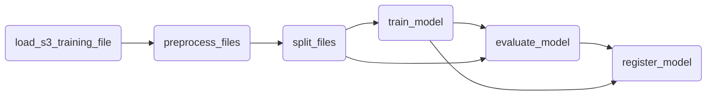
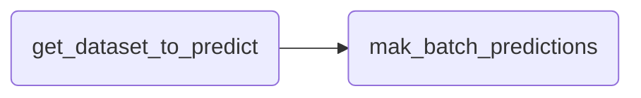
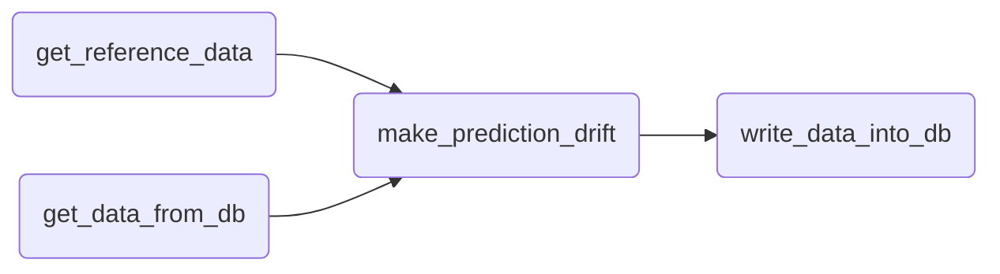

# mlops_zoomcamp_project

## Problem description

This repository is an approximation to develop a solution for the Kaggle competition called [Binary Classification with a Bank Churn Dataset](https://www.kaggle.com/competitions/playground-series-s4e1/data?select=test.csv)

The goal is to build a MLOps platform to train, evaluate, save a deploy a classification model to predict the churn of a client.

## Dataset

> The bank customer churn dataset is a commonly used dataset for predicting customer churn in the banking industry. It contains information on bank customers who either left the bank or continue to be a customer. The dataset includes the following attributes:

| Field | Description |
|--|--|
|Customer ID| A unique identifier for each customer|
|Surname| The customer's surname or last name|
|Credit Score| A numerical value representing the customer's credit score|
|Geography| The country where the customer resides (France, Spain or Germany)|
|Gender| The customer's gender (Male or Female)|
|Age| The customer's age.|
|Tenure| The number of years the customer has been with the bank|
|Balance| The customer's account balance|
|NumOfProducts| The number of bank products the customer uses (e.g., savings account, credit card)|
|HasCrCard| Whether the customer has a credit card (1 = yes, 0 = no)|
|IsActiveMember| Whether the customer is an active member (1 = yes, 0 = no)|
|EstimatedSalary| The estimated salary of the customer|
|Exited| Whether the customer has churned (1 = yes, 0 = no)|

Reference: [Bank Customer Churn Prediction](https://www.kaggle.com/datasets/shubhammeshram579/bank-customer-churn-prediction)

## Cloud

:warning: In order to save cost, this project is not deployed in cloud using IaC. However, some services were adapted to be used by containers but they could be deployed on cloud.

This project use Docker Compose to orchestrate a cluster with its own networks. The services used are the following:


- **PostgreSQL:** Database server which is used by MLFlow to save metadata.

- **MinIO:** Open source alternative to AWS S3, it's crucial to save datasets and the artifacts of MLFlow.

- **Mage AI:** Workflow Orchestration service to run the ML pipelines.

- **MLFlow:** Service used for *Experiment tracking* and *Model registry*. It was adapted to use PostgreSQL database as tracking and MinIO server to artifacts registry.

- **Flask:** Web service API to serve ML model in production to make predictions.

- **MySQL:** Database to save results of predictions, also it saves the calculation of drift.

- **Grafana:** Real time monitoring service, it shows the results saved into the MySQL database.

## Workflows

### ML Pipeline

This pipeline is available into the Mage AI service with the name of `mlops_zoomcamp_project_ml_pipeline`, the steps are the following:



You should run the pipeline the first time to create the model and serve it.

### Batch Prediction

The pipeline `mlops_zoomcamp_project_batch_predictions` allows you to make a batch predictions.



### Drift

The pipeline `mlops_zoomcamp_project_drift` allows you to calculate prediction drifts.

This pipeline should be run once batch predictions is run due to drift is calculated with batch data.



## Model Deployment

The deployment of this model is containerized in the Docker Compose file, with the name of `model_webserver`, deployment is exposed through the port `9696`. You can use the file `web_service/test.py`to probe the model.

> :warning: Web service API will be available when you run Mage AI pipeline `mlops_zoomcamp_project_ml_pipeline`.

## How to Reproduce

1. Use the file `.env-example`, then create a copy and rename it to `.env`.

2. Run the following command to start the services.

    ```
    docker compose up -d
    ```

